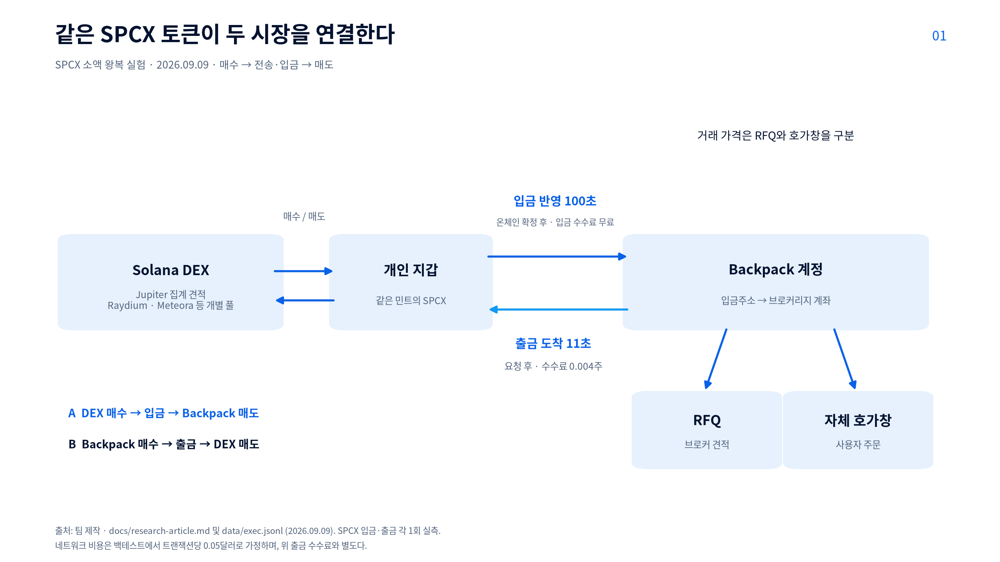
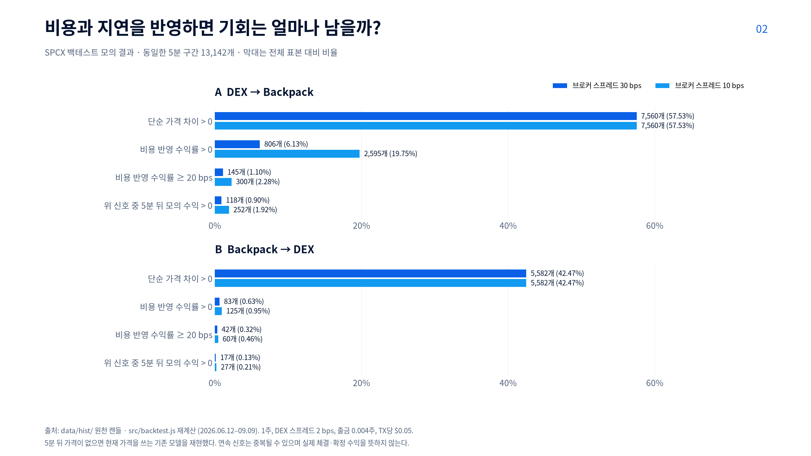
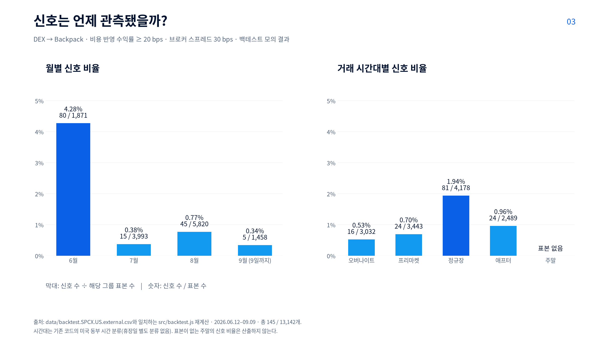

# 토큰화 주식의 가격 차이는 실제 수익이 될 수 있는가

> Solana와 Backpack의 토큰화 주식 가격을 비교하고, 사고 옮겨 파는 데 드는 비용을 빼도 수익이 남는지 확인했다.
> 같은 토큰인지, 얼마나 거래할 수 있는지, 옮기는 데 얼마나 걸리고 비용이 얼마 드는지를 함께 살폈다.
> 9월 6일부터 9일까지 수집한 실시간 호가, 상장일부터 3개월치 가격으로 거래 결과를 계산한 백테스트, 그리고 소액 거래·자금 이동 기록을 근거로 쓴 1차 초안이며, 2차 초안에서 주말 거래 시간대 표본을 추가한다.

- 작성: M3M3 / 이주호
- 기준일: 자료 확인 2026-09-06~09, 실험 2026-09-06~09, 초안 작성 2026-09-10
- 공통 주제와의 연결: [공통 주제 안에서 시장 연결 구조를 다루는 이유]

## 가격 차이를 발견한 뒤에 남는 질문

같은 물건을 한 시장에서 싸게 사서 다른 시장에서 비싸게 팔 수 있다면, 그 차이가 수익의 출발점이 된다. 하지만 화면에 두 가격이 보인다는 것만으로 해당 거래를 끝낼 수 있다고 단정할 수는 없다.

우리 팀은 토큰화 주식의 가격을 수집하고 거래 기회를 감지하는 도구를 만들면서 다음 질문을 검증하기로 했다. **관측된 가격 차이 중 실제로 사고, 옮기고, 팔 수 있는 기회는 얼마나 되는가?**

이 질문은 기획 단계에서 생겼다. 2026년 6월 SpaceX 상장과 함께 Backpack Securities가 발행한 토큰화 주식 SPCX가 Solana에서 첫날 5천만 달러 이상 거래됐고, 같은 주식이 Backpack 거래소 안에서도 거래된다는 사실을 알게 됐다([Solana 공식 블로그](https://solana.com/news/how-external-assets-start-trading-on-solana-from-day-one), 확인일 2026-09-06). 24시간 돌아가는 온체인 시장과 미국 주식 시장 시간표를 따르는 거래소 사이에 가격 차이가 생길 것으로 예상했고, 프로젝트 시작 시점에 직접 관측한 사례는 없었다.

이번에는 실제 주식으로 바꿀 수 있는 토큰을 대상으로 삼았다. Backpack은 자사 발행 토큰이 1:1로 실주식 상환이 가능하고, 브로커리지 계좌와 Solana 지갑 사이를 입출금으로 오갈 수 있다고 설명한다([Tokenized Securities](https://support.backpack.exchange/backpack-securities/tokenized-securities.md), 확인일 2026-09-06). 토큰을 두 시장 사이에서 옮길 수 있다면 가격 차이를 이용한 거래도 가능할 수 있다. 실제로 수익이 남는지는 거래 가격과 비용을 확인해야 한다.

## 가격 차이가 있어도 비용을 빼면 수익이 남을까?

토큰화 주식으로 차익거래를 하려면 두 시장에서 같은 토큰을 사고팔 수 있어야 한다. 여기에 거래 수량, 비용, 입출금 시간을 반영해도 수익이 남는지 확인했다.

확인할 내용은 세 가지였다.

1. 두 시장의 토큰은 보유자에게 같은 권리를 주며, 서로 옮길 수 있는가?
2. 같은 수량을 기준으로 계산해도 비용을 뺀 가격 차이가 남는가?
3. 자산을 전송하고 입금하는 동안 가격이 달라져도 기회가 유지되는가?

**결론(1차):** 같은 토큰을 사고 옮겨 팔 수 있었고, SPCX 입금 반영은 100초, 출금 도착은 11초 걸렸다. 그러나 비용을 뺀 수익률이 20 bps(0.2%) 이상인 구간은 SPCX 백테스트에서 DEX→Backpack 145/13,142개(1.10%), 반대 방향 42/13,142개(0.32%)였다. 실시간 자체 호가창 비교에서는 1주 기준 2,395개, 10주 기준 377개 관측 모두 이 기준을 넘지 못했다. 여기서 1 bps는 0.01%다.

## 먼저 확인할 것: 같은 주식 이름이 같은 자산을 뜻하는가

### 토큰이 나타내는 권리

Backpack이 발행한 토큰화 주식은 Backpack Securities가 보관하는 실주식을 담은 SPV(특수목적법인)에 대한 청구권이다. 보유자는 토큰을 Backpack에 입금해 전통 증권 보유분(뉴욕주 UCC 8조 증권 권리)으로 되돌릴 수 있고, 반대로 보유 주식을 토큰으로 출금할 수 있다. 배당은 토큰 수량으로 재투자되고, 분할 같은 기업 행위는 잔고 조정으로 반영된다.

- 확인한 대상: SPCX(SpaceX), MU(Micron), SNDK(SanDisk), SKHY 등 16종. 토큰을 식별하는 고유 주소인 민트 주소는 모두 Backpack 자산 API의 `contractAddress`와 일치한다. 예를 들어 SPCX는 `SPCXxcqXj6e5dJDVNovHN8744zkbhM2bYudU45BimGb`이며 온체인 메타데이터 이름이 "SpaceX - Backpack Securities"다.
- 권리와 제한: Solana Token-2022 표준이고, 전송 허용목록은 없어 지갑 간 자유롭게 옮길 수 있다. 다만 발행사가 영구 위임(permanentDelegate), 일시정지, 동결 권한을 갖는다. 즉 발행사는 언제든 토큰을 회수하거나 멈출 수 있다.
- Securitize의 역할: 관련 없음. 발행·토큰화·상환은 모두 Backpack Securities가 수행하고, 유동성 배포는 Wormhole Labs의 Sunrise가 맡는다([What is Sunrise](https://learn.backpack.exchange/articles/what-is-sunrise), 확인일 2026-09-06).
- 근거: [Tokenized Securities](https://support.backpack.exchange/backpack-securities/tokenized-securities.md), [Real Ownership & Legal Framework](https://support.backpack.exchange/backpack-securities/real-ownership-and-legal-framework.md), SPCX 민트 온체인 조회(getAccountInfo, 2026-09-06).

같은 "SpaceX 토큰"이라도 자산이 다를 수 있다. Solana에는 xStocks가 발행한 SPCXx가 별도 민트로 존재하고 둘 사이에 거래 풀까지 있다. SPCXx는 Backpack에 입금할 수 없고, 잘못 보내면 복구되지 않는다고 Backpack이 경고한다. 이 글에서는 Backpack이 발행한 같은 민트의 토큰끼리 가격을 비교한다.

### Solana에서 Backpack까지 이어지는 거래 경로

이 프로젝트가 검토한 기본 경로는 **매수 → 전송·입금 → 매도**다. Solana 쪽은 탈중앙화 거래소(DEX)의 가격을 비교했다. Jupiter(여러 거래 풀의 가격을 모아 교환 견적 제공)와 Raydium·Meteora·zerofi 등 개별 풀, Backpack 쪽은 `SPCX.US_USDC` 형태의 스팟 시장과 `SPCX.US_USDC_RFQ` 형태의 브로커 견적 시장이다.

Backpack의 체결 방식은 시간대에 따라 다르다. 미국 주식 거래 시간대(오버나이트·프리·정규·애프터, 일요일 20시부터 금요일 20시 ET)에는 브로커에게 거래 가격을 요청하는 RFQ 방식으로 거래한다. 원하는 수량을 알려 주면 브로커가 몇 초짜리 견적을 보내고, 수락하면 구속력이 생기며 정산은 브로커가 미국 시장에서 반대 거래를 마친 뒤 이뤄진다. 주말과 미국 휴장일에는 Backpack 자체 호가창으로 거래한다. 평일 정규장 밖의 RFQ에서는 1주, 2주처럼 온전한 주 단위만 되고, 소수점(0.01주)은 정규장과 주말·휴장일에만 된다([Stock Trading Hours & Fees](https://support.backpack.exchange/backpack-securities/stock-trading-hours-and-fees.md), [API 문서 Stock Trading](https://docs.backpack.exchange/), 확인일 2026-09-06).

직접 확인한 결과 문서와 다른 점이 하나 있다. SPCX·MU·SNDK·SKHY 4종의 자체 호가창은 주말뿐 아니라 평일에도 열려 있고 체결이 일어난다(9월 9일 수요일 프리마켓에 SPCX 151.33/151.76 호가, 전날 정규장 체결 기록). 평일 Backpack에는 브로커 견적과 사용자 호가창이라는 두 가격이 공존한다.

입출금은 스테이블코인과 같은 흐름이다. 출금은 일반 Solana 출금 API에 주식 심볼을 넣으면 되고 약 0.5달러 상당을 해당 주식 수량으로 차감한다(SPCX 0.004주). 입금은 사용자 전용 Solana 주소로 토큰을 보내면 되고 무료다. 무인 실행에는 지갑 주소를 주소록에 2FA 면제로 등록해야 한다. 이용 제한은 미국·영국·UAE·일본과 Backpack EU이며, 그 외 지역은 KYC 완료 계정에서 약관 동의 한 번으로 거래된다([Conversion Flow](https://support.backpack.exchange/backpack-securities/tokenized-securities/conversion-flow.md), [Eligibility & Access](https://support.backpack.exchange/backpack-securities/eligibility-and-access.md), 확인일 2026-09-06).



이미지 출처: 팀 제작. Backpack API 문서, Conversion Flow 문서, 2026-09-09 실측 기록(`data/exec.jsonl`).

## 거래 비용을 빼고 예상 수익 계산하기

### 화면의 가격과 실제 거래 가격을 구분하기

이 프로젝트의 데이터는 세 종류다. 호가는 사고팔겠다고 제시된 가격이고, 견적은 브로커가 나에게만 잠깐 제시한 가격이며, 체결은 주문이 실제 거래로 성립한 가격이다. 실시간 수집에서는 Solana 쪽은 Jupiter 견적, 즉 그 수량을 지금 교환하면 받을 토큰 수량을 썼고, Backpack 쪽은 호가창이 열려 있으면 호가창에서 필요한 수량을 모두 사고팔 때의 평균 가격를, 아니면 브로커 견적 또는 미국 시장 최근가를 썼다.

**직접 관측:** 브로커 견적, 실제 정산가, 같은 시각의 Jupiter 가격이 서로 달랐다. 9월 9일 정규장에 SPCX 0.01주를 매수·매도한 4쌍, 총 8건에서 브로커 매수·매도 호가 차이(스프레드)는 평균 30.6 bps였다. 정산가는 8건 모두 수락한 견적보다 유리했고, 견적 중간값과의 차이는 −10.6~+5.6 bps였다. 로그의 방향별 비교값(`fillVsDexBps`)으로 보면 Jupiter 가격과의 차이는 −13.7~+12.3 bps, 절댓값 평균은 7.1 bps였다. 매수에는 Jupiter 매수가, 매도에는 Jupiter 매도가를 비교했으며, 부호는 Backpack에서의 거래가 유리하면 양수다.

어떤 가격을 기준으로 계산하느냐에 따라 거래 기회 수가 달라졌다. SPCX의 DEX→Backpack 백테스트에서 브로커 스프레드를 30 bps로 가정하면 신호가 145건, 10 bps로 가정하면 300건으로 약 2.07배였다. 아래에서는 견적에서 측정한 30 bps와 실제 매수·매도 정산가로 계산한 왕복 비용 약 10 bps를 각각 적용한다. 후자는 매수와 매도 사이의 가격 변동도 포함하므로, 같은 순간의 스프레드를 직접 측정한 값은 아니다.

비교 기준 수량을 `q`로 정하고, 그 수량을 매수하는 데 필요한 금액과 전송 후 매도 가능한 수량으로 받을 금액을 같은 통화(USDC)로 계산했다.

```text
예상 순수익
= 전송 후 매도 가능한 수량의 예상 매도 대금
− 최초 수량 q의 예상 매수 대금
− 위 대금에 포함되지 않은 거래·전송·출금·환전 등 비용
```

호가창의 가격별 주문 수량과 DEX 교환 견적을 매수·매도 금액에 반영했다. 따라서 주문 수량 때문에 거래 가격이 나빠지는 효과를 비용으로 다시 빼지 않았다. 출금 수수료는 토큰 수량에서 차감되므로 매도 수량에서만 빼고 비용 항목에 중복 반영하지 않았다.

실제 계산에는 수량 1주(9월 9일부터 10주 병행), 통화 USDC, Backpack 주식 스팟 수수료 0(공식 문서), Solana 트랜잭션 건당 0.05달러, 출금 수수료는 종목별 API 값(SPCX 0.004주, MU 0.0006주, SNDK 0.0003주, SKHY 0.003주)을 썼다. 브로커 스프레드는 견적 기준 30 bps와 실제 왕복 비용을 참고한 10 bps 두 조건으로 계산했다. 제외한 비용은 Backpack 입금 수수료(무료)와 세금이다.

### 자산이 이동하는 동안 가격은 어떻게 처리할 것인가

동시점 비교와 지연 반영 비교를 구분했다. 동시점 비교는 같은 관측 시각의 매수·매도 가격을 쓴다. 지연 반영 비교는 "t 시점에 비용 반영 순수익이 임계값 이상"인 경우를 신호로 잡고, 5분 뒤 가격에 판다고 가정해 수익을 계산한다. 신호 없이 뒤 가격만 보면 변동성이 기회로 잘못 집계되기 때문에 이 규칙을 두었다. 처음 만든 버전이 실제로 그렇게 나와 수정했다.

입출금 시간은 USDC와 SPCX에서 입금·출금을 각각 1회씩 측정했다. Backpack 입금은 온체인 확정 후 84초(USDC)와 100초(SPCX)에 반영됐고, 출금은 요청 후 7초(USDC)와 11초(SPCX)에 온체인에 도착했다. 5분 지연 가정은 이번 입금 실측 84~100초보다 200~216초 길다. 자산별 1회 측정이므로 혼잡 시간대에도 같은 속도인지는 확인하지 못했다.

양쪽 시장에 자산을 미리 두는 방식은 이번에 검증하지 않았다. 매 거래 때 자산이 도착하기를 기다릴 필요는 줄지만, 양쪽에 자금을 준비해야 하고 거래 후 잔고를 다시 맞추는 데도 비용이 든다. 필요한 자금과 잔고 조정 비용은 추가로 계산해야 한다.

## 프로젝트로 확인한 결과

### 관측 및 비교 방법

- 대상 및 거래 방향: SPCX·MU·SNDK·SKHY(Backpack 자체 호가창 보유 4종)를 중심으로 MSTR·MRNA를 참고 관측. 방향은 A(DEX 매수 → 입금 → Backpack 매도)와 B(Backpack 매수 → 출금 → DEX 매도).
- 관측 기간·시간대·수집 주기: 실시간 2026-09-06 15:49 UTC부터 09-09까지 30~45초 주기로 수집했다. 현재 로그에는 주말·Labor Day 휴장일·평일 프리마켓·정규장 기록이 있다. 애프터마켓과 오버나이트는 백테스트에서 비교했다. 백테스트는 상장일 2026-06-12부터 09-09까지 5분 구간.
- 원본 데이터·코드 버전: `data/gaps.jsonl`(실시간 가격 차이), `data/rfq.jsonl`(브로커 견적), `data/rfq.fills.jsonl`(실체결), `data/exec.jsonl`(실거래 기록), `data/backtest.*.csv`, 코드 `src/`(2026-09-10 기준).
- 표본 기준: `data/gaps.jsonl`에서 2026-09-09 15:35:55.790 UTC까지 기록된 5,494행을 검토했다(시작 2026-09-06 15:49:19 UTC). 이후 추가된 행은 이번 집계에서 제외했다. 그중 자체 호가창이 있는 4종의 1주 비교는 2,395행, 10주 비교는 377행이다. DEX 오류가 없고, 호가 수량이 충분하며, 양방향 수익률이 모두 숫자인 행을 셌다. 이 두 집합에서는 제외된 행이 없었다. 짧은 간격으로 비슷한 상태를 반복 기록했으므로 각 행을 별개의 거래 기회로 볼 수는 없다. SPCX 1주 A 방향 수익률의 1차 자기상관은 0.75로, 600행의 유효 표본은 약 84개다. 120초 이내 연속 관측을 하나로 묶으면 A 방향 수익률이 양수인 구간은 SKHY 29구간(지속 시간 중앙값 31초, 상위 5% 248초), SPCX와 MU 각 1구간, SNDK 0구간이었고, 20 bps 이상 구간은 4종 모두 없었다. 백테스트는 SPCX 13,142구간, MU 7,918, SNDK 8,025, SKHY 5,080이다.
- 비교 조건: 같은 수량에 대해 단순 가격 차이 → 비용 반영 → 비용과 지연 반영.
- 기회 집계 기준: 비용 반영 순수익 20 bps 이상(백테스트), 9월 9일부터 실시간은 10 bps에 정산 변동 여유 5 bps. 연속 관측도 각각 세므로 같은 기회가 여러 번 집계될 수 있다.
- 결과의 성격: 실시간 가격 차이는 호가·견적 기반 추정이고, 백테스트는 과거 가격으로 계산한 모의 거래다. 실제 검증에는 SPCX 왕복 5단계와 별도의 RFQ 체결 8건, 자금 준비를 위한 교환·입출금이 포함된다. 입출금과 체결을 합쳐 모두 거래 건수로 세지는 않는다.

### 결과 1: 비용을 반영하면 남는 기회

**백테스트 결과( SPCX 3개월, 5분 구간 13,142개):** A 방향은 단순 가격 차이가 양수인 구간이 58%였지만 비용을 빼면 6.1%로 줄고, 20 bps 임계값을 넘는 신호는 145건(1.1%)이었다. B 방향은 42% → 0.6% → 42건(0.3%)이었다. 브로커 스프레드를 실제 왕복 비용을 참고한 10 bps로 낮추면 A 신호는 2.3%, B는 0.5%가 된다. 종목을 넓히면 30 bps 기준 A 신호 비율이 MU 1.0%, SNDK 4.3%, SKHY 7.1%이고, B 방향은 MU 2.6%, SNDK 3.0%, SKHY 2.7%다.

**직접 관측(실시간, 9월 6~9일):** Backpack 자체 호가창과 Jupiter를 비교한 결과, 비용을 뺀 수익률이 20 bps 이상인 관측은 양방향 모두 0건이었다. 1주 기준 표본은 SPCX 600개, MU 599개, SNDK 598개, SKHY 598개였다. 10주 기준 표본은 각각 95개, 94개, 94개, 94개였다. 1주 기준 최고 예상 수익률은 DEX→Backpack에서 SPCX +14.6, MU +0.5, SNDK −13.0, SKHY +7.9 bps, 반대 방향에서 SPCX −24.3, MU −1.7, SNDK +12.3, SKHY −10.5 bps였다.

**해석:** SPCX에서 단순 가격 차이가 양수인 구간은 58%였지만, 비용을 빼고 20 bps를 넘긴 구간은 1.10%였다. Backpack에서 사서 출금하는 방향에는 출금 수수료가 추가된다. 1주를 출금할 때 SPCX는 0.004주(40 bps), MU는 0.0006주(6 bps)를 수수료로 낸다. 이 차이는 주가 자체보다 종목별 수수료 수량에서 나온다. SNDK는 DEX 풀 자금이 약 16만 달러로 적어 소수의 거래에도 가격이 크게 움직였을 가능성이 있다. 이것이 백테스트 신호를 늘렸는지는 아직 확인하지 못했다.

### 결과 2: 지연을 반영하면 달라지는 기회

**백테스트 결과:** A 방향 신호 145건 중 118건(81.4%)은 5분 뒤에 팔아도 계산상 수익이 남았다. B 방향은 42건 중 17건(40.5%)이었다. 신호 전체의 5분 뒤 수익률 중앙값은 각각 +29.6 bps, −20.3 bps였다.

**직접 관측(실거래):** SPCX 0.02주 왕복 5단계가 8분 안에 끝났다. Jupiter 매수 체결가는 견적보다 3.5 bps 낮아 매수에 유리했다. Backpack 입금 반영은 100초, RFQ 매도 정산가는 견적 bid 대비 +12.5 bps, 출금 도착 11초, Jupiter 매도 체결가는 견적 대비 −2.4 bps였다. 전체 수지는 지출 3.062 USDC, 회수 2.435 USDC, 순손실 0.628 USDC로 출금 수수료 약 0.61달러가 보고된 손실 0.628 USDC의 약 97%에 해당했다. 다만 이 집계에는 별도로 지출한 SOL 네트워크 비용과 남은 토큰의 평가액이 반영되지 않아 전체 손익은 재계산이 필요하다.

**해석:** 5분 뒤에 팔면 A 방향 신호의 18.6%, B 방향 신호의 59.5%가 손익 0 이하로 바뀌었다. 지연의 영향은 방향에 따라 달랐다. 미국 시장의 가격 변화가 DEX에 반영되면서 기회가 줄었을 수 있지만, 두 시장의 가격 반영 속도와 시장 조성자의 대응 시간은 따로 측정하지 않았다.



이미지 출처: 팀 제작. `data/hist/`와 `src/backtest.js`로 재계산하고 저장된 SPCX 결과 CSV와 대조했다. 5분 뒤 가격이 없으면 현재 가격을 사용하는 기존 모델을 재현한 모의 결과이며 실제 체결 수익은 아니다.



이미지 출처: 팀 수집 데이터 `data/backtest.SPCX.US.external.csv`, `data/backtest.sensitivity.csv`, 관측 기간 2026-06-12~09-09, 코드 `src/backtest.js`. 조건: 1주, 브로커 스프레드 30 bps와 10 bps, 출금 수수료 0.004주, 트랜잭션 0.05달러, 지연 5분.

### 초기 예상과 달랐던 점

처음에는 24시간 돌아가는 DEX와 거래 시간이 정해진 거래소 사이에 가격 차이가 계속 남을 것으로 예상했다. SPCX의 A 방향 신호 145건은 6월 80건, 7월 15건, 8월 45건, 9월 9일까지 5건이었다. 거래 시간대별로는 정규장 81건, 프리마켓 24건, 애프터마켓 24건, 오버나이트 16건이었다. 전체 구간 대비 신호 비율은 6월 80/1,871개(4.28%), 7월 15/3,993개(0.38%), 8월 45/5,820개(0.77%), 9월 5/1,458개(0.34%)다. 시간대별로는 정규장 81/4,178개(1.94%), 프리마켓 24/3,443개(0.70%), 애프터마켓 24/2,489개(0.96%), 오버나이트 16/3,032개(0.53%)였다. 정규장 개장 후 30분의 신호 비율은 3.02%(10/331), 15분은 3.68%(6/163)로 나머지 정규장 1.85~1.92%의 약 2배였으나 건수가 적어 단정하지 않는다. 정규장 개장 직후에 집중됐는지는 더 짧은 시간 구간으로 나눠 확인해야 한다.

두 번째로, 처음에는 브로커 견적만으로 수익을 계산했다. 실제 체결 8건에서는 모두 견적보다 유리하게 정산됐고, 견적 스프레드 평균은 30.6 bps, 매수·매도 4쌍의 실제 왕복 비용 평균은 10.2 bps였다. 그래서 백테스트에 10 bps 조건을 추가했다. 이 차이가 다른 종목이나 시간대에도 반복되는지는 더 확인해야 한다.

세 번째로, 백테스트 신호가 많은 종목이 실제 기회가 많을 것이라 생각했다. SNDK의 백테스트 A 방향 신호 비율은 4.26%로 SPCX 1.10%의 약 3.9배였지만 1주 실시간 A 방향 비교 598개에서는 한 번도 수익률이 양수가 아니었다. 종목 선정 기준을 신호 수에서 유동성과 변동성으로 바꿨다. 근거로 삼은 값은 DEX 최대 풀 자금(SPCX 78만, SNDK 16만, SKHY 250만, MU 413만 달러)과 연속 5분 구간 DEX 종가의 절대 변화율 중앙값(SPCX 13.9, SKHY 21.7, SNDK 24.9, MU 28.7 bps)이며, 수치 기준값과 통과 종목 표는 아직 정하지 않았다. 또 9월 9일 같은 5분 구간에서 캔들 기반 수익률과 실시간 호가창 수익률을 짝지어 보니 SKHY는 평균 190 bps, SNDK는 48 bps 차이가 났는데, 이는 백테스트가 아니라 평일 자체 호가창이 사용자 잔여 주문뿐이어서 시장가에서 200 bps 떨어져 있었기 때문이었다(SKHY 호가 189.99 대 미국 시장 193.7). 평일 호가창은 가격원으로 쓸 수 없다는 것도 이때 알았다.

## 실제 수익을 가로막은 비용은 무엇인가

같은 민트의 토큰을 두 시장 사이에서 옮길 수 있었고, SPCX 입금 반영은 100초, 출금 도착은 11초 걸렸다. 다만 거래 전에 알 수 있는 브로커 견적과 실제 정산가는 달랐고, 출금에는 고정 수수료가 들었다. SPCX 출금 수수료 0.004주는 1주 거래량의 0.4%(40 bps), 10주 거래량의 0.04%(4 bps)다. 또 평일 정규장 밖의 RFQ는 최소 1주이므로 필요한 자금이 주가에 따라 달라진다.

이번에 살펴본 4종에서는 브로커의 매수·매도 호가 차이와 고정 출금 수수료 때문에 수익을 내기 어려웠다. 거래량을 늘리면 고정 수수료 비중은 줄지만, 원하는 가격에 거래할 수 있는 수량이 충분한지도 확인해야 한다.

유동성 공급자는 브로커 견적과 실제 정산가의 차이를 구분해 가격을 비교할 필요가 있다. 이번 SPCX 체결 8건에서 Jupiter 가격과의 차이는 절댓값 평균 7.1 bps였지만, 다른 종목과 시간대까지 같은 수준인지는 알 수 없다. 발행사나 거래소가 출금 수수료와 견적 스프레드를 낮추면 수익이 남는 구간이 늘어날 가능성은 있다. 다만 수수료를 실제로 바꾼 실험은 하지 않았으므로 가격 차이가 얼마나 빨리 줄어들지는 확인하지 못했다.

## 한계와 추가로 확인할 질문

- 일반화 범위: Backpack 발행 4종, 2026년 6~9월, 1~10주 수량 안에서만 말할 수 있다. 다른 발행사(xStocks 등)나 대량 거래에는 적용되지 않는다.
- 데이터와 실행의 차이: 실시간 가격 차이는 호가·견적 기반 추정이고, 백테스트는 캔들 종가라 그 시각의 스프레드와 깊이가 없다. 견적 스프레드 약 30 bps를 백테스트의 측정 오차로 볼 수는 없다. 같은 시각의 실제 거래 가능 가격과 비교한 오차 분포는 아직 계산하지 않았으므로, 개별 신호의 실현 가능성은 확인되지 않았다. 주식 실거래는 SPCX 약 0.02주로 시작한 왕복 1회와 별도의 0.01주 RFQ 체결 8건에 한정된다.
- 미확인 조건: 정산 개선폭이 변동성 구간과 프리·애프터마켓에서도 유지되는지, 대량 출금 한도, 8월 신호 재증가의 원인, 주말 거래 시간대의 새 기준 표본(2차 초안에서 추가).
- 반대 설명: 가격 차이가 없는 것이 시장 효율 때문이 아니라 표본 기간이 조용했기 때문일 수 있다. 변동성 사건 전후 관측으로 구분할 수 있다. 백테스트의 SKHY 신호는 캔들 잡음일 수 있으며, 실시간 호가와 같은 시각을 대조해 과대평가 정도를 재는 중이다.
- 추가 질문: (1) 양쪽에 재고를 미리 두면 기회가 몇 배로 늘고 자본 비용이 얼마인가. 실시간 로그로 출금·지연 항목을 제거해 재계산하면 된다. (2) 신규 상장 종목의 첫 주에 가격 차이가 얼마나 넓은가. 다음 상장 종목을 상장 당일부터 같은 도구로 관측하면 된다.

SPCX 백테스트에서 비용을 뺀 수익률이 20 bps 이상인 구간은 A 방향 145/13,142개(1.10%), B 방향 42/13,142개(0.32%)였다. 실시간 자체 호가창 비교에서는 1주 기준 2,395개, 10주 기준 377개 모두 기준을 넘지 못했다. 이번 관측에서는 입출금이 빨라도 거래 비용 때문에 수익이 거의 남지 않았다. 견적과 실제 정산가의 차이도 수익 계산에 영향을 줬다.

## 출처

- 자산 및 권리 구조: Backpack Support [Tokenized Securities](https://support.backpack.exchange/backpack-securities/tokenized-securities.md), [Real Ownership & Legal Framework](https://support.backpack.exchange/backpack-securities/real-ownership-and-legal-framework.md) / 확인일 2026-09-06 / SPV 청구권, 1:1 상환, 배당 재투자. SPCX 민트 온체인 조회(Solana RPC getAccountInfo, 2026-09-06) / Token-2022 확장 권한.
- 거래 및 입출금 지원: Backpack Support [Conversion Flow](https://support.backpack.exchange/backpack-securities/tokenized-securities/conversion-flow.md), [Stock Trading Hours & Fees](https://support.backpack.exchange/backpack-securities/stock-trading-hours-and-fees.md), [Weekend Stock Trading](https://support.backpack.exchange/backpack-securities/weekend-stock-trading.md), [Eligibility & Access](https://support.backpack.exchange/backpack-securities/eligibility-and-access.md), [FAQs](https://support.backpack.exchange/backpack-securities/faqs.md) / 확인일 2026-09-06 / 16종 입출금 활성은 `/api/v1/assets` 실측.
- Backpack API: [API 문서](https://docs.backpack.exchange/) Stock Trading, RFQ Lifecycle, Request withdrawal / 확인일 2026-09-06 / RFQ 흐름, deferred settlement, 견적가 또는 더 나은 가격 정산.
- Solana 측 거래 구조: [How External Assets Start Trading on Solana from Day One](https://solana.com/news/how-external-assets-start-trading-on-solana-from-day-one), [What is Sunrise](https://learn.backpack.exchange/articles/what-is-sunrise) / 확인일 2026-09-06 / Sunrise·Wormhole NTT, 첫날 거래량.
- 비용 및 데이터 정의: Jupiter lite-api(`/swap/v1/quote`, `/price/v3`), Raydium `transaction-v1` compute, GeckoTerminal OHLCV / 확인일 2026-09-06~09 / 견적·캔들 정의.
- 프로젝트 결과: `data/gaps.jsonl`, `data/rfq.jsonl`, `data/rfq.fills.jsonl`, `data/exec.jsonl`, `data/backtest.*.csv`, 코드 `src/` / 2026-09-10 기준 / 관측 기간 2026-09-06~09, 백테스트 2026-06-12~09-09.

<!-- 이미지 및 발행 점검
- Markdown 표는 사용하지 않는다. 비교표가 필요하면 이미지로 제작한다.
- 이미지는 이해에 필요한 구조도·결과 그래프를 우선하며, 대표 이미지는 선택이다.
- 권장 비율 16:9. BAY 팔레트: #02122F, #02295B, #08428B, #0A61E7, #129AF0, #E6F1FD.
- 외부 이미지·데이터의 출처는 이미지 바로 아래에 적는다.
- 이미지의 글자·구조·수치를 직접 검수한다. 공개 자료에서 계정 정보·API 키 등은 제거한다.
- 제목 아래 요약은 2~4문장으로 유지한다. 긴 문단을 나누고 어려운 용어는 처음 등장할 때 설명한다.
- 제출 전 모든 작성란을 채우고, 미확인 사실은 한계로 명시하거나 삭제한다.
- 2차 초안에서 갱신할 것: 결과 1·2의 실시간 수치(9/11 목요일 저녁 report, 9/13 일요일 주말 표본), 공통 주제와의 연결.
-->
